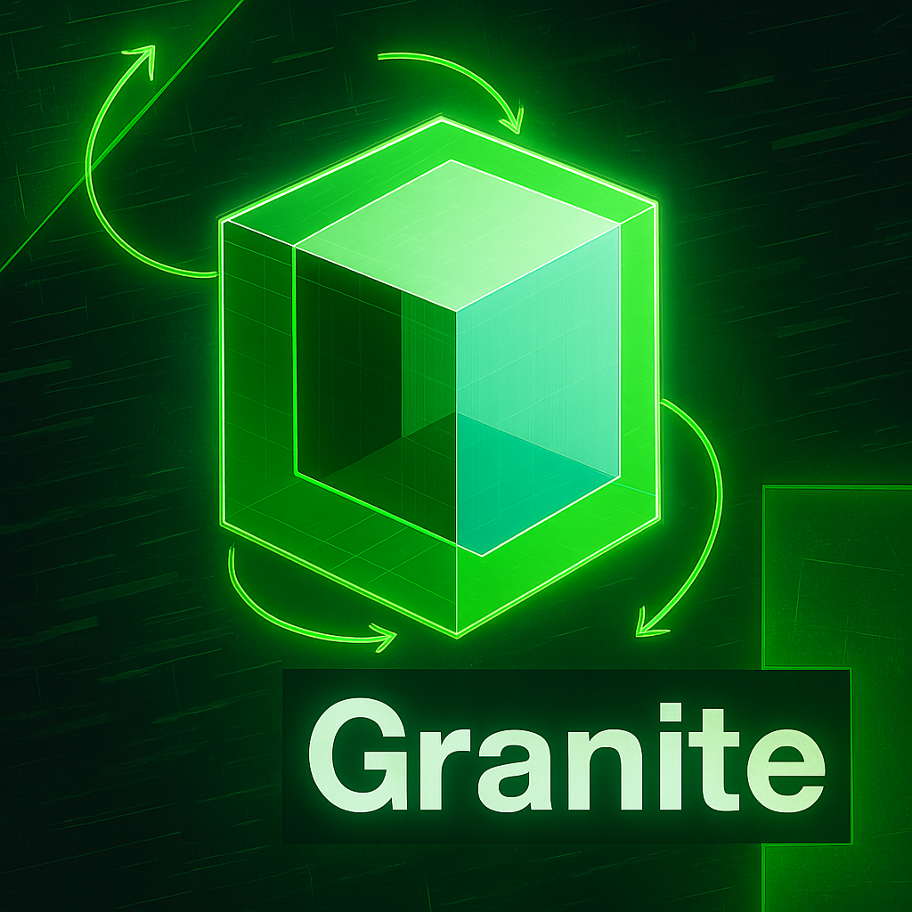

# Collaborative-workflows-granite

This course aims to share foundational knowledge on Enterprise use of IBM's Granite 3.2 Foundational Models.

☝ [Module 1](https://github.com/Jewelzufo/Collaborative-workflows-granite/blob/main/Module1.md)
---
2️⃣ [Module 2](https://github.com/Jewelzufo/Collaborative-workflows-granite/blob/main/Module2.md)
---
☘️ [Module 3](https://github.com/Jewelzufo/Collaborative-workflows-granite/blob/main/Module3.md)
---
4️⃣ [Module 4](https://github.com/Jewelzufo/Collaborative-workflows-granite/blob/main/Module4.md)
---
🕔 [Module 5](https://github.com/Jewelzufo/Collaborative-workflows-granite/blob/main/Module5.md)
---
